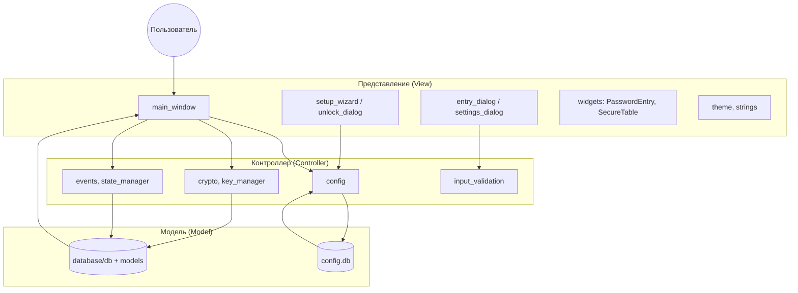
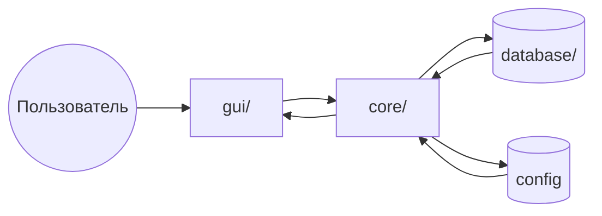

# CryptoSafe Manager

Локальный менеджер паролей. Все данные хранятся на компьютере пользователя, без облака и внешних серверов. Один мастер-пароль открывает доступ к хранилищу записей (логин, пароль, URL, заметки). Приложение подходит для личного использования и учебных проектов.

---

## Содержание

- [Видение продукта](#видение-продукта)
- [Архитектура и диаграмма MVC](#архитектура-и-диаграмма-mvc)
- [Структура проекта](#структура-проекта)
- [Безопасность](#безопасность)
- [Сборка](#сборка)
- [Требования](#требования)
- [Установка и запуск](#установка-и-запуск)
- [Спринты](#спринты)

---

## Видение продукта

CryptoSafe Manager нужен, чтобы хранить логины и пароли в одном месте под одним мастер‑паролем. Приложение не зависит от облака: пользователь сам владеет файлами (конфиг и база с записями). Цель — простой и предсказуемый инструмент для повседневного хранения учётных данных с возможностью переноса данных между машинами.

---

## Архитектура и диаграмма MVC

Используется MVC-подобное разделение:

- **Model (модель)** — данные и правила работы с ними: `database/` (схема, CRUD по основной БД), а также хранение настроек в `core/config.py` (своя БД конфигурации).
- **View (представление)** — всё, что видит пользователь: `gui/` (главное окно, диалоги, виджеты, темы, строки интерфейса).
- **Controller (контроллер)** — связующая логика между действиями пользователя и данными: часть кода в `core/` (конфиг, шифрование, события, состояние, валидация ввода) и обработчики в `gui/main_window.py`.

Поток данных: пользователь взаимодействует с GUI → обработчики вызывают core и database → данные читаются/пишутся в БД и конфиг → обновлённый интерфейс отображает результат.

### Диаграмма MVC (поток данных)



Упрощённая схема потока (пользователь → GUI → core → БД):



---

## Структура проекта

```
crypto/
├── src/
│   ├── core/                    # Логика: конфиг, шифрование, события, состояние
│   │   ├── crypto/              # abstract + placeholder (XOR, зануление ключа)
│   │   ├── events.py            # Шина событий: подписка/публикация, sync и очередь
│   │   ├── config.py            # Настройки в отдельной SQLite (config.db)
│   │   ├── input_validation.py  # Валидация и санитизация ввода
│   │   ├── state_manager.py     # Сессия, таймер буфера, неактивность
│   │   ├── audit.py             # Подписка на события → запись в audit_log
│   │   ├── key_manager.py       # Заглушки: derive_key, store_key, load_key
│   │   └── clipboard/           # Спринт 4: secure clipboard, адаптеры, мониторинг
│   ├── database/
│   │   ├── models.py            # DDL таблиц (vault_entries, audit_log, settings, key_store)
│   │   └── db.py                # Подключение, init_db, CRUD, backup/restore (заглушки)
│   ├── gui/
│   │   ├── main_window.py       # Главное окно: меню, таблица, статус, таймер буфера
│   │   ├── setup_wizard.py      # Первый запуск: пароль, путь к БД, настройки шифрования
│   │   ├── unlock_dialog.py     # Ввод мастер-пароля при каждом запуске
│   │   ├── entry_dialog.py      # Добавление/редактирование записи
│   │   ├── settings_dialog.py   # Настройки: безопасность, внешний вид, доп.
│   │   ├── view_windows.py      # Окно монитора состояния, просмотр журнала аудита
│   │   ├── theme.py             # Тема: системная, тёмная, светлая
│   │   ├── strings.py           # Строки интерфейса (ru/en)
│   │   └── widgets/             # PasswordEntry, SecureTable
│   └── main.py                  # Точка входа: тема, мастер настройки, разблокировка
├── tests/                       # Юнит и интеграционные тесты
├── requirements.txt
└── README.md
```

В конфиге (отдельная БД) хранятся: путь к основной БД, хеш мастер-пароля, соль для шифрования записей, таймаут буфера, авто-блокировка, тема, язык.

---

## Безопасность

- Секреты не в коде: соль и параметры из конфига или переменной окружения `CRYPTO_VAULT_SALT`.
- Ввод проверяется и обрезается по длине, управляющие символы удаляются.
- В GUI при ошибках показывается общее сообщение, без деталей реализации.
- Доступ к файлам только к необходимым (конфиг, хранилище).

---

## Сборка

- Зависимости перечислены в `requirements.txt` с указанием версий.
- На [Sprint 8](#спринт-8) планируются Dockerfile или скрипт сборки для упаковки.

---

## Требования

- Python 3.8+

---

## Установка и запуск

1. Перейти в каталог проекта: `cd crypto`
2. Создать виртуальное окружение: `python -m venv .venv`
3. Активировать: Windows — `.venv\Scripts\Activate.ps1`, Linux/macOS — `source .venv/bin/activate`
4. Установить зависимости: `pip install -r requirements.txt`
5. Запуск приложения: `python -m src.main`
6. Тесты: из корня проекта `pytest tests/` (conftest подставляет src в путь)
7. Проверка стиля (PEP 8): `ruff check src/`

---

## Спринты

Ниже перечислены спринты и планируемые в них реализации. Ссылки ведут к соответствующим подразделам.

| Спринт | Содержание |
|--------|------------|
| [Спринт 1](#спринт-1) | Основа: конфиг, БД, шифрование-placeholder, ключи-заглушки, события, аудит, состояние, базовый GUI |
| [Спринт 2](#спринт-2) | Реальный вывод ключа из пароля (PBKDF2 и т.п.), store_key/load_key |
| [Спринт 3](#спринт-3) | Замена XOR на AES-GCM в crypto |
| [Спринт 4](#спринт-4) | Secure Clipboard: авто-очистка, мониторинг, защита буфера |
| [Спринт 5](#спринт-5) | Полноценный просмотр журнала аудита, подпись записей |
| [Спринт 6](#спринт-6) | Генератор паролей |
| [Спринт 7](#спринт-7) | Дополнительные настройки и доработки |
| [Спринт 8](#спринт-8) | Резервное копирование и восстановление, Dockerfile/скрипт сборки |

---

### Спринт 1

**Реализовано:** каркас приложения под первый спринт.

- **Конфигурация:** настройки в отдельной SQLite-БД (config.db); ключи: путь к БД, хеш мастер-пароля, соль, таймаут буфера, тема, язык. Соль для шифрования записей — из конфига или переменной окружения.
- **База данных:** DDL в `models.py` (vault_entries, audit_log, settings, key_store); в `db.py` — несколько подключений, создание схемы по DDL, user_version, CRUD для записей хранилища, запись в audit_log. Шифрование не в слое БД — данные приходят уже подготовленными.
- **Шифрование:** абстрактный сервис (encrypt/decrypt с ключом), placeholder на XOR; зануление ключа в памяти после использования (одно место).
- **Ключи:** заглушки KeyManager: derive_key, store_key, load_key.
- **События:** шина событий (подписка/публикация), синхронная и асинхронная (очередь) обработка.
- **Аудит:** подписка на события и запись в таблицу audit_log.
- **Состояние:** StateManager (сессия, таймер буфера, неактивность).
- **Валидация ввода:** проверка и санитизация полей, лимиты длины.
- **GUI:** главное окно (меню, таблица записей, статус, таймер буфера), мастер первого запуска, диалог ввода мастер-пароля при каждом запуске, диалог добавления/редактирования записи, настройки, темы (системная/тёмная/светлая), язык (ru/en), виджеты (PasswordEntry, SecureTable), окна монитора состояния и журнала аудита (заглушки).
- **Тесты:** юнит-тесты БД, крипто, событий, конфига; интеграционные (окно, мастер настройки). Линтер (ruff).

---

### Спринт 2

**Реализовано:** мастер-пароль, Argon2/PBKDF2, key_store, смена пароля.

- Хеширование мастер-пароля через Argon2id (`key_derivation.py`), проверка в постоянное время (`secrets.compare_digest` при ошибке).
- Валидатор силы пароля: длина ≥12, регистр, цифры, спецсимволы, не из списка простых (`authentication.py`).
- Два ключа: auth_hash (Argon2) в key_store для проверки входа; ключ шифрования через PBKDF2-HMAC-SHA256 из пароля и соли, в key_store хранится только соль.
- Таблица `key_store`: key_type, key_data (BLOB), version, created_at; миграция с версии 1 схемы.
- Кэш ключа в памяти (`key_storage.py`), сброс при выходе и при неактивности 1 час.
- Первый запуск: мастер настройки пишет auth_hash и enc_salt в key_store; разблокировка читает из key_store, проверяет Argon2, выводит ключ PBKDF2, кэширует, публикует `UserLoggedIn`.
- Экспоненциальная задержка при неверном вводе: 1–2 попытки 1 с, 3–4 — 5 с, 5+ — 30 с.
- Диалог смены пароля: проверка текущего, валидация нового, перешифровка записей новым ключом, откат key_store при ошибке.
- Шифрование записей в главном окне через `KeyManager` (ключ из кэша). При выходе ключ обнуляется (`main.py`).
- Тесты: Argon2, консистентность PBKDF2, constant-time, обнуление кэша, сила пароля (`tests/test_sprint2_crypto.py`).

---

### Спринт 3
**Реализовано:** vault CRUD с per-entry AES-256-GCM, генератором паролей и обновлённым интерфейсом таблицы.

- Добавлен слой vault в `src/core/vault/` (`entry_manager.py`, `encryption_service.py`, `password_generator.py`) для централизованного CRUD и шифрования.
- Шифрование per-entry: AES-256-GCM через `cryptography.hazmat.primitives.ciphers.aead.AESGCM`, nonce 12 байт (`os.urandom(12)`), формат хранения BLOB как `nonce || ciphertext || tag`, аутентификация проверяется при расшифровке.
- Payload шифруется как JSON и включает поля записи (`title`, `username`, `password`, `url`, `notes`, `category`), `created_at` и `version`; в БД хранится только `encrypted_data`, ключ шифрования нигде не сохраняется в БД.
- `EntryManager` реализует `create_entry/get_entry/get_all_entries/update_entry/delete_entry` и публикует события создания/обновления/удаления (`EntryCreated/EntryUpdated/EntryDeleted` + совместимо с `EntryAdded` для старых подписчиков).
- GUI интеграция спринта 3: `SecureTable` показывает сортируемые колонки (Title), masked username (`••••` после 4 символов), домен URL и last modified, плюс колонку пароля с `eye`-toggle; есть глобальный toggle и shortcut `Ctrl+Shift+P`, контекстное меню и multi-select.
- Диалог записи (`EntryDialog`) содержит strength meter, кнопку `Generate Password` с попапом конфигурации, валидацию URL и best-effort favicon подгрузку.
- Поиск/фильтр в таблице работает realtime: поддерживаются fuzzy-подобия и фильтры `title:"..."`, `username:"..."`, `url:"..."`, `notes:"..."`.
- База данных обновлена под новый формат: `vault_entries` хранит `encrypted_data` (nonce+ciphertext+tag), добавлены индексы на `created_at/updated_at/tags`, а `db.py` использует connection pooling для GUI-операций.
- Тесты дополнены под спринт 3: AES-GCM round-trip/целостность, CRUD-интеграция через `EntryManager`, и тест генератора (10,000 уникальных паролей и проверка валидатором силы).

---

### Спринт 4

**Реализовано:** безопасная работа с буфером обмена и доработка GUI.

- Добавлен модуль `src/core/clipboard/` (`clipboard_service.py`, `platform_adapter.py`, `clipboard_monitor.py`) с Observer-моделью и событиями `ClipboardCopied/ClipboardCleared`.
- Реализована авто-очистка буфера по таймауту (настройка в `Settings`), очистка при ручной команде, блокировке сессии и закрытии приложения.
- Добавлены платформенные адаптеры: Windows (`win32clipboard` при наличии), Linux (`wl-clipboard`/`xclip`/`xsel`), fallback через `pyperclip`, а также безопасный Qt-fallback.
- В таблице и меню есть копирование логина, пароля и `Copy all`; в статус-баре отображается состояние буфера и предупреждение за 5 секунд до очистки.
- Добавлен монитор внешних изменений буфера: если содержимое изменилось вне приложения, секрет очищается в приложении ускоренно.
- Исправлены «неразборчивые» кнопки показа пароля: вместо emoji используются читаемые `Показать/Скрыть` (`Show/Hide`) в том же стиле, что остальной UI.
- Убраны языковые несоответствия в GUI: локализованы подписи `Last modified`, `Category`, параметры генератора пароля и сообщения валидации URL.
- Добавлены новые настройки спринта 4: уведомления буфера, уровень безопасности (basic/advanced/paranoid), whitelist приложений.

**Что добавлено сверх первоначального описания:** защита от внешней подмены содержимого буфера и отдельный status-indicator в нижней панели для быстрой проверки, что секрет всё ещё под контролем таймера.

---

### Спринт 5

**Планируется:** полноценный журнал аудита.

- Реализация просмотра журнала аудита (данные из audit_log, фильтры, поиск).
- Подпись записей аудита (поле signature в audit_log) для обеспечения целостности.

---

### Спринт 6

**Планируется:** генератор паролей.

- Генерация случайных паролей с настраиваемой длиной и набором символов.
- Вставка сгенерированного пароля в форму добавления/редактирования записи.

---

### Спринт 7

**Планируется:** дополнительные настройки и полировка.

- Расширение настроек (безопасность, внешний вид, прочее).
- Исправление замечаний, рефакторинг, улучшение UX.

---

### Спринт 8

**Планируется:** резервное копирование и упаковка.

- Реализация функций backup и restore (резервная копия и восстановление хранилища).
- Dockerfile или скрипт сборки для упаковки приложения (например, образ или исполняемый пакет).
