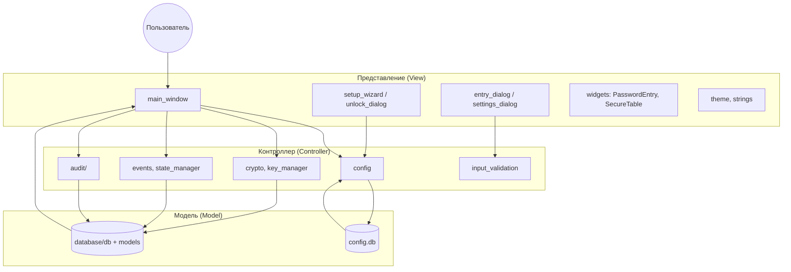
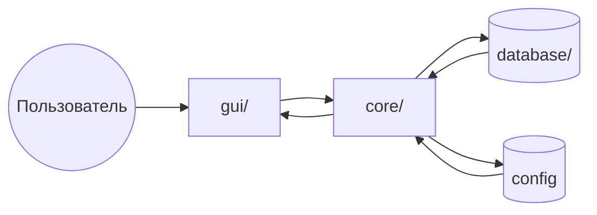

# CryptoSafe Manager

Локальный менеджер паролей. Все данные хранятся на компьютере пользователя, без облака и внешних серверов. Один мастер-пароль открывает доступ к хранилищу записей (логин, пароль, URL, заметки). Приложение подходит для личного использования и учебных проектов.

---

## Содержание

- [Видение продукта](#видение-продукта)
- [Архитектура и диаграмма MVC](#архитектура-и-диаграмма-mvc)
- [Структура проекта](#структура-проекта)
- [Безопасность](#безопасность)
- [Сборка](#сборка)
- [Требования](#требования)
- [Установка и запуск](#установка-и-запуск)
- [Спринты](#спринты)

---

## Видение продукта

CryptoSafe Manager нужен, чтобы хранить логины и пароли в одном месте под одним мастер‑паролем. Приложение не зависит от облака: пользователь сам владеет файлами (конфиг и база с записями). Цель — простой и предсказуемый инструмент для повседневного хранения учётных данных с возможностью переноса данных между машинами.

---

## Архитектура и диаграмма MVC

Используется MVC-подобное разделение:

- **Model (модель)** — данные и правила работы с ними: `database/` (схема, CRUD по основной БД), а также хранение настроек в `core/config.py` (своя БД конфигурации).
- **View (представление)** — всё, что видит пользователь: `gui/` (главное окно, диалоги, виджеты, темы, строки интерфейса).
- **Controller (контроллер)** — связующая логика между действиями пользователя и данными: часть кода в `core/` (конфиг, шифрование, события, состояние, валидация ввода) и обработчики в `gui/main_window.py`.

Поток данных: пользователь взаимодействует с GUI → обработчики вызывают core и database → данные читаются/пишутся в БД и конфиг → обновлённый интерфейс отображает результат.

### Диаграмма MVC (поток данных)


```mermaid
flowchart TB
    subgraph View["Представление (View)"]
        A[main_window]
        B[setup_wizard / unlock_dialog]
        C[entry_dialog / settings_dialog]
        D[widgets: PasswordEntry, SecureTable]
        E[theme, strings]
    end
    subgraph Controller["Контроллер (Controller)"]
        F[config]
        G[crypto, key_manager]
        H[events, state_manager]
        I[input_validation]
        A5[audit/]
    end
    subgraph Model["Модель (Model)"]
        J[(database/db + models)]
        K[(config.db)]
    end
    User((Пользователь)) --> A
    A --> F
    A --> G
    A --> H
    A --> A5
    B --> F
    C --> I
    F --> K
    G --> J
    H --> J
    A5 --> J
    J --> A
    K --> F
```

Упрощённая схема потока (пользователь → GUI → core → БД):


```mermaid
flowchart LR
    User((Пользователь)) --> GUI[gui/]
    GUI --> Core[core/]
    Core --> DB[(database/)]
    Core --> Config[(config)]
    DB --> Core
    Config --> Core
    Core --> GUI
```

---

## Структура проекта

```
crypto/
├── src/
│   ├── core/                    # Логика: конфиг, шифрование, события, состояние
│   │   ├── crypto/              # abstract + placeholder (XOR, зануление ключа)
│   │   ├── events.py            # Шина событий: подписка/публикация, sync и очередь
│   │   ├── config.py            # Настройки в отдельной SQLite (config.db)
│   │   ├── input_validation.py  # Валидация и санитизация ввода
│   │   ├── state_manager.py     # Сессия, таймер буфера, неактивность
│   │   ├── audit/               # Спринт 5: подпись журнала, проверка целостности
│   │   ├── vault/               # Спринт 3: EntryManager, AES-GCM, генератор паролей
│   │   ├── import_export/       # Спринт 6: экспорт/импорт, шаринг, QR, key_exchange
│   │   ├── security/            # Спринт 7: память, паника, авто-блокировка, профили
│   │   ├── backup_service.py    # Спринт 8: резервные копии .csafe.zip
│   │   ├── key_manager.py       # Кэш ключа шифрования после PBKDF2
│   │   └── clipboard/           # Спринт 4: secure clipboard, адаптеры, мониторинг
│   ├── database/
│   │   ├── models.py            # DDL таблиц (vault_entries, audit_log, settings, key_store)
│   │   └── db.py                # Подключение, init_db, CRUD, backup/restore (заглушки)
│   ├── gui/
│   │   ├── main_window.py       # Главное окно: меню, таблица, статус, таймер буфера
│   │   ├── setup_wizard.py      # Первый запуск: пароль, путь к БД, настройки шифрования
│   │   ├── unlock_dialog.py     # Ввод мастер-пароля при каждом запуске
│   │   ├── entry_dialog.py      # Добавление/редактирование записи
│   │   ├── settings_dialog.py   # Настройки: безопасность, внешний вид, доп.
│   │   ├── view_windows.py      # Окно монитора состояния, просмотр журнала аудита
│   │   ├── theme.py             # Тема: системная, тёмная, светлая
│   │   ├── strings.py           # Строки интерфейса (ru/en)
│   │   └── widgets/             # PasswordEntry, SecureTable
│   └── main.py                  # Точка входа: тема, мастер настройки, разблокировка
├── tests/                       # Юнит и интеграционные тесты
├── requirements.txt
└── README.md
```

В конфиге (отдельная БД) хранятся: путь к основной БД, хеш мастер-пароля, соль для шифрования записей, таймаут буфера, авто-блокировка, тема, язык.

---

## Безопасность

- Секреты не в коде: соль и параметры из конфига или переменной окружения `CRYPTO_VAULT_SALT`.
- Ввод проверяется и обрезается по длине, управляющие символы удаляются.
- В GUI при ошибках показывается общее сообщение, без деталей реализации.
- Доступ к файлам только к необходимым (конфиг, хранилище).

---

## Сборка

- Зависимости: `requirements.txt` (pytest, cryptography, PyQt6, pyinstaller, …).
- Запуск из исходников: `python run.py`
- Исполняемый файл (PyInstaller): `python scripts/build_executable.py` → `dist/CryptoSafeManager/`
- Отчёт тестов: `python scripts/generate_test_report.py` → `tests/report/`

---

## Требования

- Python 3.8+

---

## Установка и запуск

### Windows

1. `cd cryptosafe-manager`
2. `python -m venv .venv` → `.venv\Scripts\Activate.ps1`
3. `pip install -r requirements.txt`
4. `python run.py`

### Linux

```bash
git clone https://github.com/lonelywarsaw/cryptosafe-manager.git
cd cryptosafe-manager
chmod +x scripts/setup_linux.sh scripts/run_linux.sh
bash scripts/setup_linux.sh
bash scripts/run_linux.sh
```

### macOS

```bash
python3 -m venv .venv && source .venv/bin/activate
pip install -r requirements.txt
python run.py
```

### Тесты и отчёты

- `pytest tests/ -q --ignore=tests/test_integration.py`
- `python scripts/generate_test_report.py`
- `ruff check src/`

---

## Спринты

Ниже перечислены спринты и планируемые в них реализации. Ссылки ведут к соответствующим подразделам.

| Спринт | Содержание |
|--------|------------|
| [Спринт 1](#спринт-1) | Основа: конфиг, БД, шифрование-placeholder, ключи-заглушки, события, аудит, состояние, базовый GUI |
| [Спринт 2](#спринт-2) | Реальный вывод ключа из пароля (PBKDF2 и т.п.), store_key/load_key |
| [Спринт 3](#спринт-3) | Замена XOR на AES-GCM в crypto |
| [Спринт 4](#спринт-4) | Secure Clipboard: авто-очистка, мониторинг, защита буфера |
| [Спринт 5](#спринт-5) | Журнал аудита с целостностью, просмотр и экспорт |
| [Спринт 6](#спринт-6) | Импорт/экспорт, шаринг, QR-обмен ключами |
| [Спринт 7](#спринт-7) | Дополнительные настройки и доработки |
| [Спринт 8](#спринт-8) | Резервное копирование и восстановление, Dockerfile/скрипт сборки |

---

### Спринт 1

**Реализовано:** фундамент проекта — модульная архитектура, конфигурация, база данных, событийная система и базовый GUI.

**Модули и файлы:**

| Файл / Каталог                    | Роль |
|----------------------------------|------|
| core/config.py                 | Работа с настройками (отдельная БД config.db) |
| core/events.py                 | Событийная шина (Observer pattern + async) |
| core/state_manager.py          | Управление состоянием сессии и таймерами неактивности |
| core/input_validation.py       | Валидация и санитизация пользовательского ввода |
| core/crypto/                   | Placeholder-шифрование (XOR) + secure wipe |
| database/db.py + models.py   | Инициализация SQLite, создание таблиц, миграции |
| gui/main_window.py             | Главное окно приложения |
| gui/setup_wizard.py            | Мастер первого запуска |
| gui/unlock_dialog.py           | Диалог ввода мастер-пароля |
| gui/theme.py, strings.py     | Темизация и строки интерфейса |

**Ключевые возможности:**
- Полноценная событийная архитектура
- Отдельная конфигурационная база данных
- Инициализация и миграция основной БД
- Базовый GUI + мастер первого запуска
- Placeholder криптография с безопасным очищением памяти

**Тесты:** tests/test_config.py, test_database.py, test_events.py, test_crypto.py

---

### Спринт 2

**Реализовано:** безопасная обработка мастер-пароля, качественное выведение ключа и авторизация.

**Модули и файлы:**

| Файл / Каталог                        | Роль |
|--------------------------------------|------|
| core/key_manager.py                | Управление ключами (derive, store, load) |
| core/crypto/key_derivation.py      | Вывод ключа из мастер-пароля (Argon2id) |
| core/authentication.py             | Авторизация, проверка мастер-пароля |
| core/crypto/                       | Улучшенное шифрование (переход от placeholder) |
| database/db.py                     | Таблица key_store для хранения производных ключей |
| gui/unlock_dialog.py               | Диалог разблокировки + обработка ошибок |

**Ключевые возможности:**
- Хеширование мастер-пароля через Argon2id
- Сравнение хэшей в постоянное время (secrets.compare_digest)
- Валидация силы мастер-пароля
- Безопасное хранение и загрузка главного ключа
- Функция смены мастер-пароля
- Улучшенная обработка ошибок авторизации

**Тесты:** tests/test_sprint2_auth.py, tests/test_key_derivation.py

---

### Спринт 3

**Реализовано:** полноценное хранилище записей с шифрованием на уровне каждой записи, генератор паролей и обновлённый интерфейс списка.

**Ядро (`src/core/vault/`):**

| Модуль | Назначение |
|--------|------------|
| `encryption_service.py` | AES-256-GCM: nonce 12 байт, BLOB `nonce \|\| ciphertext \|\| tag`, payload — JSON полей записи |
| `entry_manager.py` | CRUD: `create_entry`, `get_entry`, `get_all_entries`, `update_entry`, `delete_entry` |
| `password_generator.py` | Случайные пароли: длина, наборы символов, исключение похожих знаков |

- Ключ шифрования берётся из `KeyManager` (PBKDF2 после разблокировки); в `vault_entries` лежит только `encrypted_data`.
- События: `EntryCreated`, `EntryUpdated`, `EntryDeleted` и совместимое `EntryAdded` для аудита и тестов.
- В списке записей пароль не держится постоянно в памяти — подгружается при редактировании и копировании.

**GUI:**

- `SecureTable`: сортировка по названию, маска логина (`••••` после 4 символов), домен из URL, дата изменения, колонка пароля с показом по строке.
- Глобальный «Показать пароли» и `Ctrl+Shift+P`, контекстное меню, множественный выбор.
- `EntryDialog`: индикатор силы пароля, «Сгенерировать пароль» с настройками, проверка URL, favicon (best-effort).
- Поиск в реальном времени: подстрока и фильтры `title:`, `username:`, `url:`, `notes:`.

**База данных:** индексы по `created_at`, `updated_at`, `tags`; пул соединений в `db.py` для отзывчивого GUI.

**Тесты:** `tests/test_sprint3_vault.py`, `tests/test_sprint3_perf.py` — round-trip AES-GCM, CRUD, уникальность 10 000 сгенерированных паролей.

---

### Спринт 4

**Реализовано:** безопасный буфер обмена с авто-очисткой, мониторингом и интеграцией в главное окно.

**Модули (`src/core/clipboard/`):**

| Файл | Роль |
|------|------|
| `clipboard_service.py` | Копирование, один таймер через `StateManager`, события `ClipboardCopied` / `ClipboardCleared` |
| `platform_adapter.py` | Windows: `win32clipboard` + Qt; ленивый импорт PyQt6 (CI без libEGL) |
| `clipboard_monitor.py` | Наблюдатель: внешняя подмена буфера → ускоренная очистка в приложении |
| `secure_buffer.py` | Вспомогательные буферы для кратковременного хранения копируемого текста |

**Поведение:**

- Таймаут очистки из настроек; сброс при блокировке, выходе и явной команде «Очистить буфер».
- В статус-баре: «Буфер: N с» и предупреждение за 5 секунд до очистки.
- Копирование логина, пароля и «Копировать всё» из таблицы и контекстного меню.
- Очистка буфера ОС с GUI-потока (`QTimer.singleShot`), без вызовов Qt из фоновых потоков.

**Настройки:** уведомления буфера, уровень безопасности (basic / advanced / paranoid), whitelist приложений.

**Тесты:** `tests/test_sprint4_clipboard.py` — таймер, очистка, события, GUI smoke (где доступен дисплей).

---

### Спринт 5

**Реализовано**: полноценный журнал аудита с криптографической защитой целостности, просмотр, фильтры и базовый экспорт.

**Модули (src/core/audit/):**

| Файл                    | Роль |
|-------------------------|------|
| audit_logger.py       | Центральный сервис логирования, подписка на события |
| log_signer.py         | Создание цифровых подписей (HMAC-SHA256 + hash chain) |
| log_verifier.py       | Проверка целостности логов, hash chain, обнаружение tampering |
| integrity.py          | Проверка при старте приложения и по запросу пользователя |
| view_windows.py       | GUI-окно журнала аудита |

**Поведение:**

- Логируются ключевые события: вход/выход, CRUD, буфер, импорт/экспорт, паника, профили.
- Чувствительные данные — `[REDACTED]`; цепочка `previous_hash` + HMAC подпись.
- Проверка целостности при старте; GUI: фильтры, экспорт JSON/CSV.

**Тесты:** `tests/test_sprint5_audit_validation.py`, `tests/test_sprint5_audit_perf.py`
---

### Спринт 6

**Реализовано:** импорт/экспорт, шаринг, QR/key exchange, GUI, таблицы БД, тесты TEST/PERF.

**Каталог `src/core/import_export/`:**

| Компонент | TRD | Содержание |
|-----------|-----|------------|
| `exporter.py` | EXP | Encrypted JSON, CSV, Bitwarden/LastPass (plain и encrypted), RSA-обёртка data_key |
| `importer.py` | IMP | merge / replace / dry-run; лимит 10 MB и таймаут 30 с; санитизация |
| `sharing_service.py` | SHR | Share по паролю или RSA-OAEP; срок 1–30 дней; read_only / editable |
| `key_exchange.py` | QR-3 | RSA-2048, ECC P-256, fingerprint, контакты в config |
| `qr_codec.py` | QR-1–2 | checksum, chunking, PNG (`qrcode`, опционально) |
| `formats/` | EXP/IMP | json, csv, bitwarden, lastpass |

**GUI:** `src/gui/import_export_dialogs.py` — экспорт, импорт, share, QR viewer; пункты меню в `main_window.py`.

**БД (SCHEMA_VERSION 5):** `shared_entries`, `import_export_history`; миграция в `db.py`.

- Мастер-пароль обязателен при экспорте/импорте Encrypted JSON.
- События `VaultExported`, `VaultImported`, `EntryShared` → аудит (спринт 5).

**Тесты:** `tests/test_sprint6_import_export.py` (TEST-1..5), `tests/test_sprint6_perf.py` (PERF-1..4).

**Планируется:** QR-сканер с камеры, сетевые share-link.

---

### Спринт 7

**Реализовано:** усиление безопасности, авто-блокировка, трей, режим паники, профили.

| Модуль | Назначение |
|--------|------------|
| `core/security/side_channel_protection.py` | Сравнение в постоянное время |
| `core/security/memory_guard.py` | Secure wipe, SecretBuffer |
| `core/security/activity_monitor.py` | Idle + Windows GetLastInputInfo |
| `core/security/panic_mode.py` | Экстренная блокировка |
| `core/security/security_profiles.py` | Standard / Enhanced / Paranoid |
| `gui/tray_icon.py` | Системный трей |

- Горячая клавиша паники: `Ctrl+Shift+Esc`; сворачивание в трей.
- События: `VaultLocked`, `PanicModeActivated`, `SecurityProfileChanged`.

**Тесты:** `tests/test_sprint7_security.py`, `tests/test_sprint7_perf.py`

---

### Спринт 8

**Реализовано:** финальная интеграция, backup, упаковка, документация.

| Артефакт | Назначение |
|----------|------------|
| `core/backup_service.py` | Архив `.csafe.zip` + manifest SHA-256 |
| `run.py` | Запуск из корня репозитория |
| `cryptosafe.spec` + `scripts/build_executable.py` | PyInstaller |
| `scripts/generate_test_report.py` | junit + coverage в `tests/report/` |
| `docs/user_guide.md`, `docs/technical.md` | Руководство и архитектура |

**Тесты:** `tests/test_sprint8_backup.py` + полный набор `tests/test_sprint*.py`
