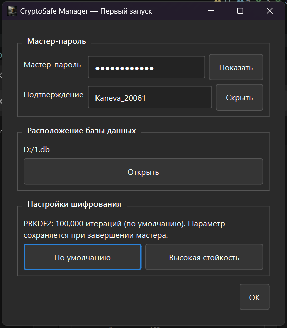
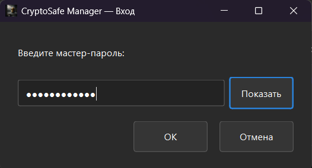
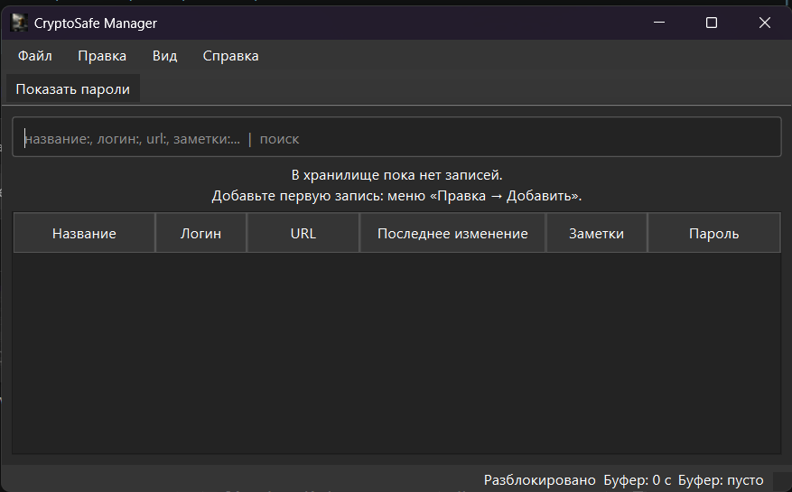
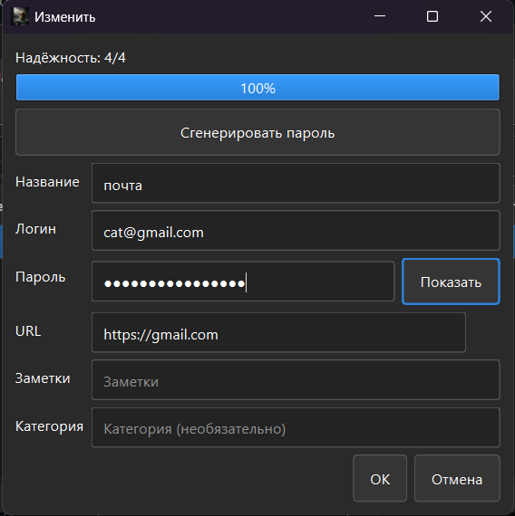
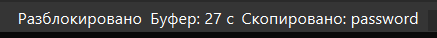
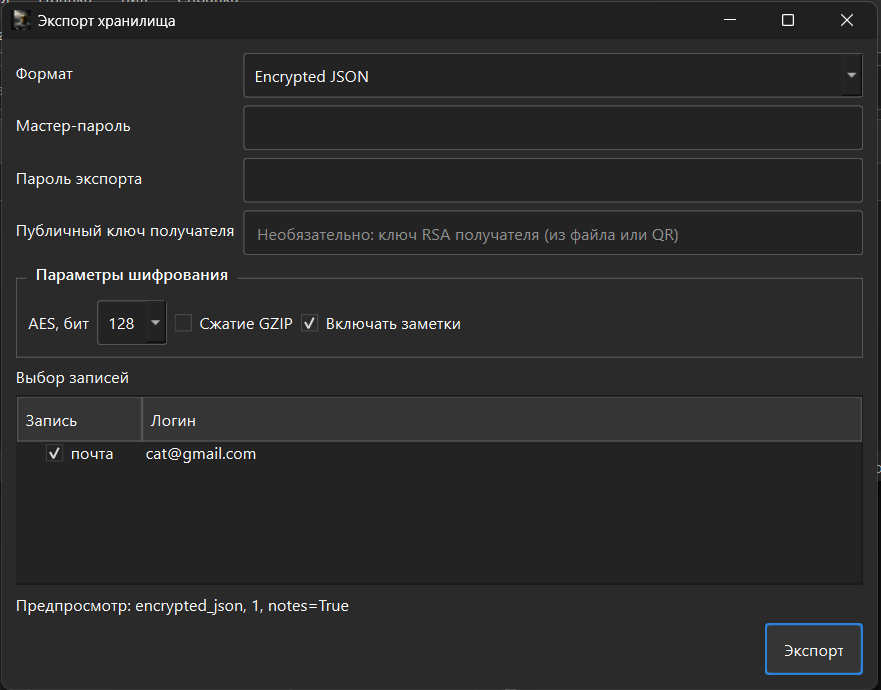
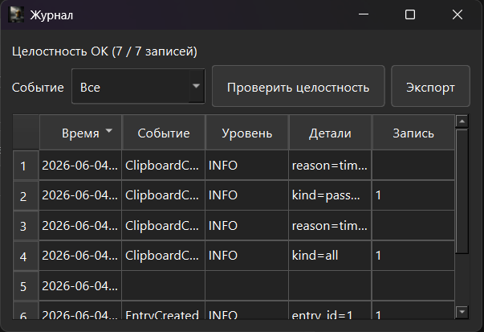
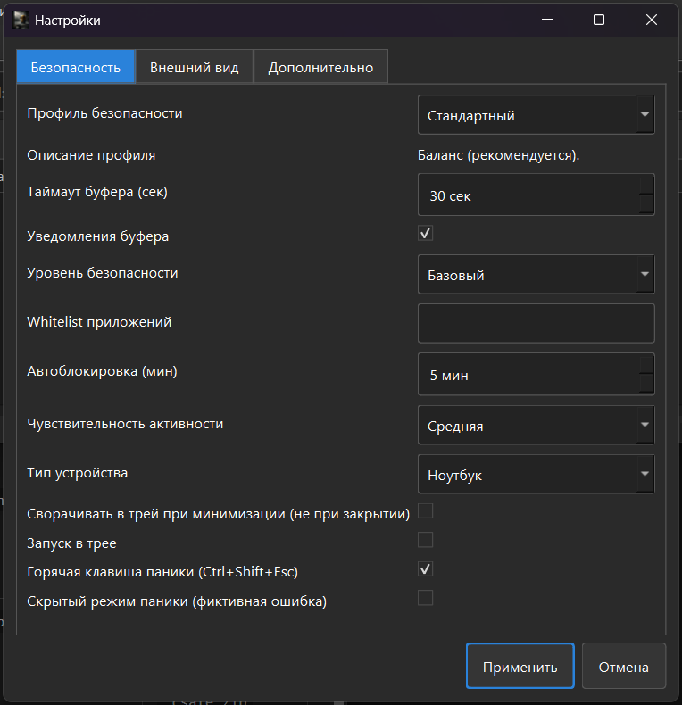
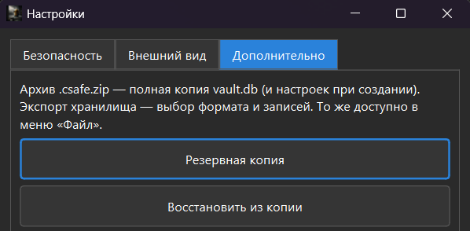
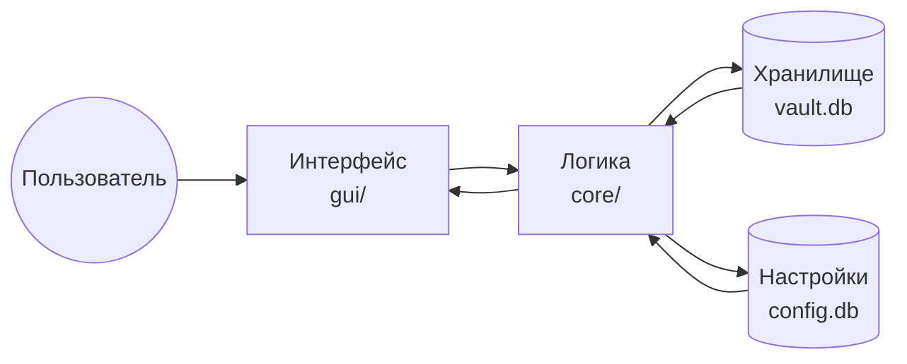

# CryptoSafe Manager

Локальный менеджер паролей. Все данные хранятся на компьютере пользователя, без облака и внешних серверов. Один мастер-пароль открывает доступ к хранилищу записей (логин, пароль, URL, заметки). Приложение подходит для личного использования и учебных проектов.

---

## Содержание

- [Обзор и назначение](#обзор-и-назначение)
- [Настройка](#настройка)
- [Использование основных функций](#использование-основных-функций)
- [Известные ограничения](#известные-ограничения)
- [Направления развития](#направления-развития)
- [Документация](#документация)
- [Архитектура](#архитектура)
- [Структура проекта](#структура-проекта)
- [Разработка и тесты](#разработка-и-тесты)
- [Спринты (TRD)](#спринты-trd)

---

## Обзор и назначение

**CryptoSafe Manager** — локальный менеджер паролей для Windows, Linux и macOS. Все секреты хранятся **только на вашем компьютере** в зашифрованной базе SQLite; облака и внешних серверов нет.

**Для кого:** личное использование, учебные проекты, демонстрация безопасной архитектуры (AES-GCM, Argon2, аудит, защищённый буфер).

**Ключевые возможности:**

- одно хранилище под **мастер-паролем**;
- **AES-256-GCM** для каждой записи;
- **буфер обмена** с автоочисткой;
- **импорт/экспорт** (JSON, CSV, Bitwarden, LastPass);
- **журнал аудита** с проверкой целостности;
- **профили безопасности**, трей, режим паники;
- **резервные копии** `.csafe.zip` и сборка **.exe** (PyInstaller).

Подробнее для пользователей: [docs/user_guide.md](docs/user_guide.md).  
Для разработчиков: [docs/technical.md](docs/technical.md).

---

## Настройка

### Требования

- Python 3.8+
- Графическая среда (рабочий стол; на Linux — X11/Wayland при необходимости)

### Установка зависимостей и запуск приложения

На всех ОС: **`git clone` → `setup_*` (один раз) → `run_*`**.

**Windows (PowerShell):**

```powershell
git clone https://github.com/lonelywarsaw/cryptosafe-manager.git
cd cryptosafe-manager
.\scripts\setup_windows.ps1
.\scripts\run_windows.ps1
```

**Linux:**

```bash
git clone https://github.com/lonelywarsaw/cryptosafe-manager.git
cd cryptosafe-manager
chmod +x scripts/setup_linux.sh scripts/run_linux.sh
bash scripts/setup_linux.sh
bash scripts/run_linux.sh
```

**macOS:**

```bash
git clone https://github.com/lonelywarsaw/cryptosafe-manager.git
cd cryptosafe-manager
chmod +x scripts/setup_macos.sh scripts/run_macos.sh
bash scripts/setup_macos.sh
bash scripts/run_macos.sh
```

Альтернатива: `python run.py` после `pip install -r requirements.txt`.

### Сборка исполняемого файла (PyInstaller)

| ОС | Сборка | Запуск |
|----|--------|--------|
| Windows | `.\scripts\build_windows.ps1` | `dist\CryptoSafeManager\CryptoSafeManager.exe` |
| Linux | `bash scripts/build_linux.sh` | `dist/CryptoSafeManager/CryptoSafeManager` |
| macOS | `bash scripts/build_macos.sh` | `dist/CryptoSafeManager/CryptoSafeManager` |

Скопируйте **всю папку** `dist/CryptoSafeManager/` на целевой ПК.

---

## Использование основных функций

### Первый запуск и разблокировка



Мастер: мастер-пароль, путь к `vault.db`, выбор стойкости PBKDF2 (100k / 600k итераций).



При каждом запуске — ввод мастер-пароля; после успеха ключ держится в памяти до блокировки.

### Записи и поиск



Таблица записей, поиск (`title:`, `username:`, …), копирование логина/пароля, таймер буфера в статус-баре.



Добавление и изменение: генератор пароля, индикатор силы, URL.

| Действие | Меню / shortcut |
|----------|-----------------|
| Добавить запись | Правка → Добавить / `Ctrl+N` |
| Изменить | Правка → Изменить / `Ctrl+E`, `F2`, `Enter` (в таблице) |
| Удалить | Правка → Удалить / `Delete` (в таблице) |
| Поиск | Поле над таблицей / `Ctrl+F` (очистка — `Esc`) |
| Копировать логин | Правка / `Ctrl+Shift+U` |
| Копировать пароль | Правка / `Ctrl+Shift+C` |
| Копировать всё | Правка / `Ctrl+Shift+A` |
| Очистить буфер | Правка / `Ctrl+Shift+B` |
| Показать пароли | Панель / `Ctrl+Shift+P` |
| Разблокировать | Файл → Разблокировать / `Ctrl+Shift+O` |
| Заблокировать | Файл → Заблокировать / `Ctrl+Shift+L` |
| Журнал аудита | Вид → Журнал / `Ctrl+Shift+J` |
| Настройки | Вид → Настройки / `Ctrl+,` |

**Навигация с клавиатуры (UX-1):** `Tab` — поиск ↔ таблица; стрелки — строки и колонки; полный список — **Справка → Горячие клавиши**.

### Защищённый буфер обмена



Копирование → таймер очистки (настройки) → автоматический сброс; **Правка → Очистить буфер**.

### Импорт, экспорт, резервная копия



**Файл → Экспорт / Импорт хранилища** — Encrypted JSON, CSV, Bitwarden, LastPass.  
**Файл → Резервная копия / Восстановить** — архив `.csafe.zip`.

### Журнал аудита и настройки



**Вид → Журнал** — события и проверка целостности.



Профиль безопасности, таймаут буфера, автоблокировка, тема, язык.

### Режим паники и трей

- **Ctrl+Shift+Esc** — блокировка, очистка буфера, скрытие окна.
- Сворачивание в **трей** (если включено в настройках).



---

## Известные ограничения

- **Нет облачной синхронизации** между устройствами — только ручной перенос `vault.db` или экспорт.
- **Нет браузерного расширения** — автозаполнение в браузере не поддерживается.
- **Мастер-пароль не восстанавливается** — при потере пароля нужна резервная копия vault (без пароля данные не расшифровать).
- **Сборка кросс-платформенная:** `.exe` только на Windows, бинарник Linux — на Linux (PyInstaller на той же ОС).
- **QR-сканер камеры** — в основном Windows (`pyzbar`); на Linux опционально.
- **Настройки шифрования в мастере** задают PBKDF2 при **создании** хранилища; смена итераций для существующего vault — только через пересоздание/миграцию вручную.
- Журнал аудита на очень больших объёмах может замедлять проверку целостности при старте.

---

## Направления развития

- Синхронизация через пользовательский облачный диск (шифрованный файл vault, без своего сервера).
- Браузерное расширение или экспорт в формат менеджеров с автозаполнением.
- Миграция параметров PBKDF2 для существующего хранилища из GUI.
- QR-сканер и камера на Linux/macOS «из коробки».
- Подпись исполняемого файла (code signing) для Windows/macOS.
- Улучшение доступности (a11y) и локализация дополнительных языков.

---

## Документация

| Документ | Назначение |
|----------|------------|
| [docs/user_guide.md](docs/user_guide.md) | Руководство пользователя |
| [docs/technical.md](docs/technical.md) | Архитектура, криптография, схема БД |
| [sprints/](sprints/) | Спецификации требований по спринтам (TRD) |
| Docstrings в `src/` | Описание публичных API модулей |

---

## Архитектура

Проект разделён по **MVC-подобной** схеме (не строгий фреймворк MVC, а разделение ответственности):

| Слой | Где в коде | Что делает |
|------|------------|------------|
| **Представление** | `src/gui/` | Окна, кнопки, таблица, диалоги — всё, что видит пользователь |
| **Логика приложения** | `src/core/` | Шифрование, буфер, аудит, импорт/экспорт, события, настройки |
| **Данные** | `src/database/`, `vault.db`, `config.db` | Хранение записей, журнала и конфигурации |

**Поток:** действие в интерфейсе → вызов модуля в `core/` → чтение/запись в SQLite → обновление экрана.

Ниже — **блок-схема в формате Mermaid**. На GitHub и в VS Code она рисуется автоматически; если среда не поддерживает Mermaid, виден только текст блока ` ```mermaid ` — это нормально, не ошибка README.


```mermaid
flowchart LR
    U((Пользователь)) --> GUI["Интерфейс<br/>gui/"]
    GUI --> CORE["Логика<br/>core/"]
    CORE --> VDB[("Хранилище<br/>vault.db")]
    CORE --> CDB[("Настройки<br/>config.db")]
    VDB --> CORE
    CDB --> CORE
    CORE --> GUI
```

Подробные диаграммы (слои, разблокировка, крипто) — в [docs/technical.md](docs/technical.md).

---

## Структура проекта

```
crypto/
├── src/
│   ├── core/                    # Логика: конфиг, шифрование, события, состояние
│   │   ├── crypto/              # abstract + placeholder (XOR, зануление ключа)
│   │   ├── events.py            # Шина событий: подписка/публикация, sync и очередь
│   │   ├── config.py            # Настройки в отдельной SQLite (config.db)
│   │   ├── input_validation.py  # Валидация и санитизация ввода
│   │   ├── state_manager.py     # Сессия, таймер буфера, неактивность
│   │   ├── audit/               # Спринт 5: подпись журнала, проверка целостности
│   │   ├── vault/               # Спринт 3: EntryManager, AES-GCM, генератор паролей
│   │   ├── import_export/       # Спринт 6: экспорт/импорт, шаринг, QR, key_exchange
│   │   ├── security/            # Спринт 7: память, паника, авто-блокировка, профили
│   │   ├── backup_service.py    # Спринт 8: резервные копии .csafe.zip
│   │   ├── key_manager.py       # Кэш ключа шифрования после PBKDF2
│   │   └── clipboard/           # Спринт 4: secure clipboard, адаптеры, мониторинг
│   ├── database/
│   │   ├── models.py            # DDL таблиц (vault_entries, audit_log, settings, key_store)
│   │   └── db.py                # Подключение, init_db, CRUD, backup/restore (заглушки)
│   ├── gui/
│   │   ├── main_window.py       # Главное окно: меню, таблица, статус, таймер буфера
│   │   ├── setup_wizard.py      # Первый запуск: пароль, путь к БД, настройки шифрования
│   │   ├── unlock_dialog.py     # Ввод мастер-пароля при каждом запуске
│   │   ├── entry_dialog.py      # Добавление/редактирование записи
│   │   ├── settings_dialog.py   # Настройки: безопасность, внешний вид, доп.
│   │   ├── view_windows.py      # Окно монитора состояния, просмотр журнала аудита
│   │   ├── theme.py             # Тема: системная, тёмная, светлая
│   │   ├── strings.py           # Строки интерфейса (ru/en)
│   │   └── widgets/             # PasswordEntry, SecureTable
│   └── main.py                  # Точка входа: тема, мастер настройки, разблокировка
├── tests/                       # Юнит и интеграционные тесты
├── requirements.txt
└── README.md
```

В `config.db` хранятся путь к `vault.db`, хеш мастер-пароля, соль шифрования, таймаут буфера, автоблокировка, тема и язык.

---

## Разработка и тесты

- Секреты не зашиты в код: соль из конфига или `CRYPTO_VAULT_SALT`.
- Ввод валидируется; в GUI — сообщения без внутренних деталей.
- Линтер: `ruff check src/`
- Тесты по умолчанию: `pytest` (без `perf` и `slow`; см. `pytest.ini`)
- Отчёт покрытия: `python scripts/generate_test_report.py` → `tests/report/index.html`
- Полный прогон: `pytest --override-ini="addopts=-q --strict-markers"`
- CI: GitHub Actions (Linux)

---

## Спринты (TRD)

История разработки по этапам. **Спецификации требований** — в каталоге [sprints/](sprints/), не в README.

| Спринт | Файл TRD | Тема |
|--------|----------|------|
| 1 | [sprints/sprint1.md](sprints/sprint1.md) | Конфиг, БД, события, базовый GUI |
| 2 | [sprints/sprint2.md](sprints/sprint2.md) | Мастер-пароль, Argon2, ключи |
| 3 | [sprints/sprint3.md](sprints/sprint3.md) | Vault, AES-GCM, таблица записей |
| 4 | [sprints/sprint4.md](sprints/sprint4.md) | Защищённый буфер обмена |
| 5 | [sprints/sprint5.md](sprints/sprint5.md) | Журнал аудита, целостность |
| 6 | [sprints/sprint6.md](sprints/sprint6.md) | Импорт/экспорт, шаринг, QR |
| 7 | [sprints/sprint7.md](sprints/sprint7.md) | Профили, трей, паника, UX |
| 8 | [sprints/sprint8.md](sprints/sprint8.md) | Backup, сборка, документация |
