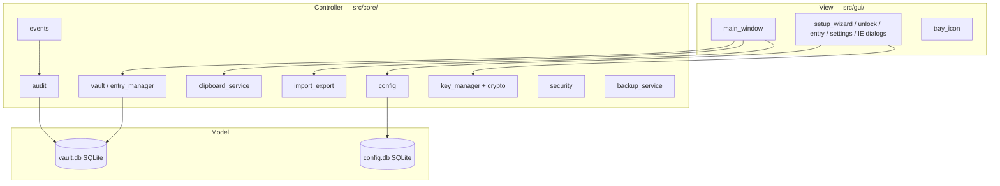
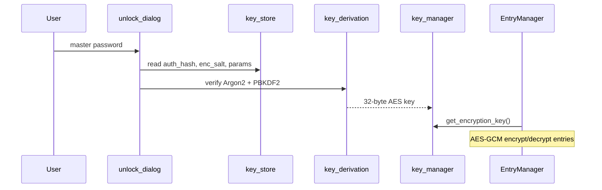
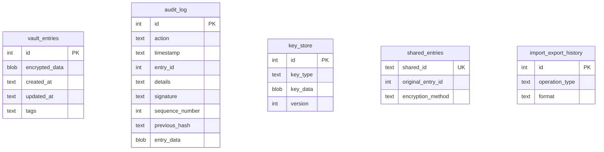

# Техническое описание — CryptoSafe Manager

Документ для разработчиков и проверяющих (Sprint 8, DOC-3): архитектура, криптография, структуры данных и схема БД.

---

## 1. Обзор архитектуры

### 1.1 Назначение системы

CryptoSafe Manager — десктопное приложение (PyQt6) для локального хранения учётных записей. Клиент выполняет:

- аутентификацию по мастер-паролю;
- CRUD над записями с шифрованием на уровне записи;
- безопасный буфер обмена с автоочисткой;
- импорт/экспорт и локальный обмен;
- журнал аудита с проверкой целостности;
- резервное копирование vault.

Облачной синхронизации и сетевого API **нет**.

### 1.2 Слои (MVC-подобная модель)



| Слой | Каталог | Ответственность |
|------|---------|-----------------|
| **View** | `src/gui/` | Отображение, ввод пользователя, меню, таблица, статус-бар |
| **Controller** | `src/core/` | Бизнес-логика, крипто, события, политики безопасности |
| **Model** | `src/database/`, `config.py` | Персистентность: BLOB записей, аудит, key_store |

Связность снижается за счёт шины **`core/events.py`**: GUI и сервисы публикуют события (`EntryCreated`, `ClipboardCopied`, …), подписчики (аудит, UI) реагируют без прямых циклических импортов.

### 1.3 Точки входа

| Файл | Роль |
|------|------|
| `run.py` | Добавляет `src/` в `sys.path`, вызывает `main.main()` |
| `src/main.py` | `QApplication`, мастер/разблокировка, `MainWindow`, `CoInitialize` на Windows |
| `cryptosafe.spec` | Сборка PyInstaller → `dist/CryptoSafeManager/` |

### 1.4 Поток разблокировки сессии



---

## 2. Криптографические решения

### 2.1 Сводная таблица

| Цель | Алгоритм | Параметры / хранение |
|------|----------|----------------------|
| Проверка мастер-пароля | **Argon2id** | Хеш в `key_store.auth_hash`; time_cost=3, memory=64 MiB (настраиваемо через config) |
| Ключ шифрования записей | **PBKDF2-HMAC-SHA256** | Соль `enc_salt` (16 байт); итерации 100k (default) или 600k (high); ключ 32 байта |
| Шифрование записи | **AES-256-GCM** | Nonce 12 байт; BLOB = `nonce ‖ ciphertext ‖ tag` |
| Экспорт Encrypted JSON | **PBKDF2** + **AES-GCM** | Отдельный `data_key` на операцию; HKDF `cryptosafe-export-v1` |
| Шаринг RSA | **RSA-OAEP-SHA256** | Обёртка `data_key` для получателя |
| Аудит | **HMAC-SHA256** | Ключ из HKDF `audit-signing`; цепочка `previous_hash` |
| Сравнение секретов | `secrets.compare_digest` | Обёртка в `side_channel_protection` |

### 2.2 Мастер-пароль (Argon2id)

- Функции: `hash_password_argon2`, `verify_password_argon2` (`core/crypto/key_derivation.py`).
- При неверном пароле выполняется фиктивное сравнение для сглаживания тайминга.
- Валидация сложности: `validate_password_strength` — длина ≥12, классы символов, blacklist.

### 2.3 Ключ записей (PBKDF2)

```text
master_password + enc_salt --PBKDF2(iterations)--> encryption_key (32 bytes)
```

- Итерации сохраняются в `key_store.params` (JSON): `pbkdf2_iterations`, `salt_len`, `key_len`, `version`.
- После успешного входа ключ кэшируется в `key_storage` (`set_encryption_key` / `clear_encryption_key` при блокировке).

### 2.4 Payload записи (AES-GCM)

`EncryptionServiceAESGCM` (`core/vault/encryption_service.py`):

1. Поля записи сериализуются в JSON (title, username, password, url, notes, category, timestamps, version).
2. `encrypt_entry_payload` → `EncryptedPayload(encrypted_blob)`.
3. `decrypt_entry_payload` проверяет auth tag (tampering → исключение).

Структура BLOB:

```text
[ 12 bytes nonce ][ ciphertext ][ 16 bytes GCM tag ]
```

### 2.5 Экспорт и импорт

- **Отдельный** от vault-ключа материал: `derive_export_material()` (HKDF).
- Пакет Encrypted JSON: метаданные KDF + зашифрованный `data_key` + ciphertext entries.
- Импорт: `VaultImporter` — sanitize, лимиты полей, режимы merge/replace/dry-run.

### 2.6 Аудит

- Каждая запись: `sequence_number`, `previous_hash`, `entry_data`, `signature`.
- `verify_audit_chain` — обнаружение разрыва цепочки или неверной подписи.
- `verify_integrity` при старте приложения (выборка записей).

---

## 3. Структуры данных

### 3.1 Запись vault (логическая модель)

После расшифровки — словарь Python:

| Поле | Тип | Описание |
|------|-----|----------|
| `id` | int | PK в `vault_entries` |
| `title` | str | Название сервиса |
| `username` | str | Логин |
| `password` | str | Секрет (только при явном чтении/редактировании) |
| `url` | str | URL |
| `notes` | str | Заметки |
| `category` / `tags` | str | Категория / теги |
| `created_at`, `updated_at` | str/int | Метки времени |
| `version` | int | Версия payload для миграций |

В списке (`get_all_entries`) пароль **не** возвращается — только `username_masked`, `url_domain`.

### 3.2 Конфигурация (`config.db`)

Таблица `settings` (key-value): `db_path`, `language`, `theme`, `clipboard_timeout`, `security_profile`, `auto_lock_minutes`, и др. Константы ключей — `core/config.py`.

### 3.3 События (`core/events.py`)

Синхронные и асинхронные подписчики. Основные типы:

`EntryCreated`, `EntryUpdated`, `EntryDeleted`, `UserLoggedIn`, `UserLoggedOut`, `ClipboardCopied`, `ClipboardCleared`, `VaultExported`, `VaultImported`, `VaultLocked`, `PanicModeActivated`, `BackupCreated`, `BackupRestored`.

### 3.4 Резервная копия `.csafe.zip`

```json
// manifest.json (пример)
{
  "format": "cryptosafe-backup-v1",
  "schema_version": 5,
  "vault_sha256": "...",
  "entry_count": 42,
  "created_at": "..."
}
```

Файлы в архиве: `vault.db`, `manifest.json`.

---

## 4. Схема базы данных

`SCHEMA_VERSION = 5` (`src/database/models.py`). Инициализация: `database/db.init_db()`.

### 4.1 ER-диаграмма (логическая)



### 4.2 Таблицы

#### `vault_entries`

| Колонка | Тип | Описание |
|---------|-----|----------|
| `id` | INTEGER PK | Идентификатор |
| `encrypted_data` | BLOB | AES-GCM ciphertext |
| `created_at` | TEXT | Unix timestamp создания |
| `updated_at` | TEXT | Unix timestamp изменения |
| `tags` | TEXT | Теги / категория |

Индексы: `created_at`, `updated_at`, `tags`.

#### `audit_log`

Журнал с цепочкой хешей и HMAC-подписью (см. спринт 5).

#### `key_store`

| `key_type` | Содержимое `key_data` |
|------------|------------------------|
| `auth_hash` | Argon2 hash мастер-пароля (UTF-8) |
| `enc_salt` | Соль PBKDF2 (16 байт) |
| `params` | JSON параметров PBKDF2 |

#### `shared_entries`, `import_export_history`

Метаданные обмена и истории операций импорта/экспорта (спринт 6).

### 4.3 Пул соединений

`db.py` использует пул SQLite-соединений для GUI-потока; операции через `_with_connection` / `apply(conn)`.

---

## 5. Ключевые модули по подсистемам

| Подсистема | Модули |
|------------|--------|
| Vault | `entry_manager.py`, `encryption_service.py`, `password_generator.py` |
| Clipboard | `clipboard_service.py`, `platform_adapter.py`, `clipboard_monitor.py` |
| Security | `activity_monitor.py`, `panic_mode.py`, `security_profiles.py`, `memory_guard.py` |
| Import/Export | `exporter.py`, `importer.py`, `sharing_service.py`, `key_exchange.py`, `formats/*` |
| Backup | `backup_service.py` |
| Audit | `audit_logger.py`, `log_signer.py`, `log_verifier.py`, `integrity.py` |

---

## 6. Сборка и тестирование

```bash
pip install -r requirements.txt
pytest
python scripts/generate_test_report.py
python scripts/build_executable.py
```

- Покрытие тестами: ≥80% по `core/` + `database/` (см. `.coveragerc`, без GUI).
- Отчёт: `tests/report/index.html`.

---

## 7. Зависимости

См. `requirements.txt`: PyQt6, cryptography, argon2-cffi, pywin32 (Windows), qrcode, pyinstaller.

---

## 8. См. также

- [user_guide.md](user_guide.md) — сценарии пользователя
- [README.md](../README.md) — установка и обзор функций
